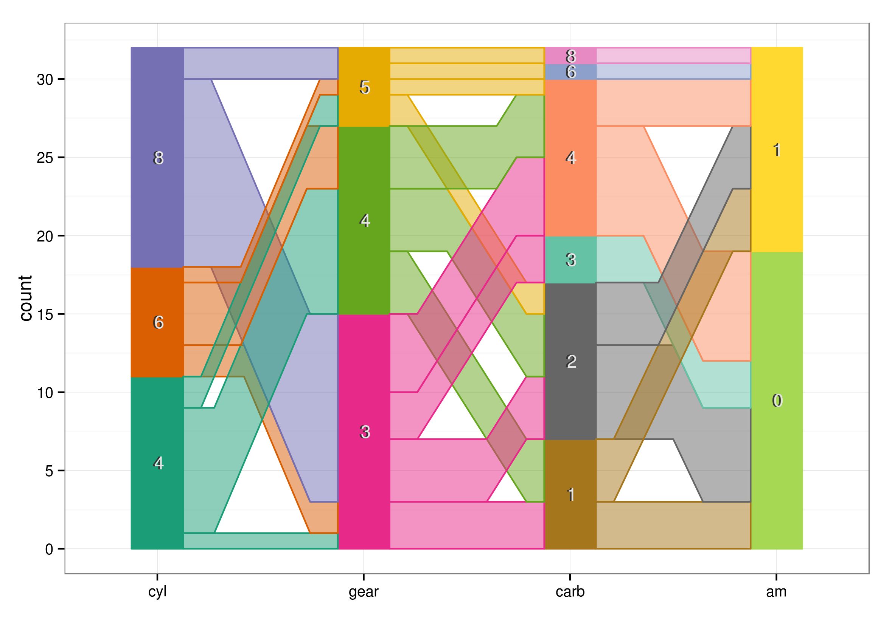

<h2>Background: Parallel Coordinate Plots</h2>
One application of parallel coordinate plots (PCPs) is to allow visualization of multi-dimensional data. 
For each dimension (variable) a vertical axis is drawn. For a dataset of six variables, there
would be 6 vertical axis drawn. Each record is represented by a polyline that
intersects each axis at the observed value. Vertical axes are scaled to 1.

<figure>

<figcaption>Parallel coordinate plot of mtcars dataset, variables: miles per gallon (mpg), horsepower (hp), weight (wt),
displacement (disp), rear axle ratio (drat) and 1/4 mile time (qsec) </figcaption>
</figure>  

<h2>Hammock </h2>
Hammock plots are similar to PCPs in the ability to display multiple variables as vertical axes, but with application to categorical data.
The vertical axes are shown as <b><i>stacked bar charts capturing the proportion of observations for each category. Ribbons connect observation pairs, with the ribbon thickness indicating the relative number of observations for that pair</i></b>.

<figure>

<figcaption>Hammock plot of mtcars dataset, variables: number of cylinders (cyl), number of gears (gear), auto or manual transmission (am),
number of carbuerators (carb) </figcaption>
</figure>

  

<h2>Parallel Sets</h2>
Parallel sets are similar to PCPs in the ability to display multiple variables as vertical axes, but with application to categorical data.
The vertical axes are shown as stacked bar charts capturing the proportion of observations for each category. Ribbons connect observation pairs, with the ribbon thickness indicating the relative number of observations for that pair. <b><i>Ribbons intersect an axis in an ordered manner</i></b>.

<figure>

<figcaption>Parallel Set for mtcars dataset, variables: number of cylinders (cyl), number of gears (gear), auto or manual transmission (am),
number of carbuerators (carb) </figcaption>
</figure>

  

<h2>Common angles</h2>
Common angles are similar to PCPs in the ability to display multiple variables as vertical axes, but with application to categorical data.
The vertical axes are shown as stacked bar charts capturing the proportion of observations for each category. Ribbons connect observation pairs, with the ribbon thickness indicating the relative number of observations for that pair. Ribbons intersect an axis in an ordered manner and <b><i>with an offset</i></b>.

<figure>

<figcaption>Hammock plot of mtcars dataset, variables: number of cylinders (cyl), number of gears (gear), auto or manual transmission (am),
number of carbuerators (carb) </figcaption>
</figure>

  

<h2>Adjusted angles</h2>
Adjusted angles are similar to PCPs in the ability to display multiple variables as vertical axes, but with application to categorical data.
The vertical axes are shown as stacked bar charts capturing the proportion of observations for each category. Ribbons connect observation pairs, with the ribbon thickness indicating the relative number of observations for that pair. Ribbons intersect an axis in an ordered manner and with an offset. <b><i>An additional adjustment is made to keep thickness of a single ribbon consistent across the display</i></b>.

<figure>

<figcaption>Hammock plot of mtcars dataset, variables: number of cylinders (cyl), number of gears (gear), auto or manual transmission (am),
number of carbuerators (carb) </figcaption>
</figure>

  

